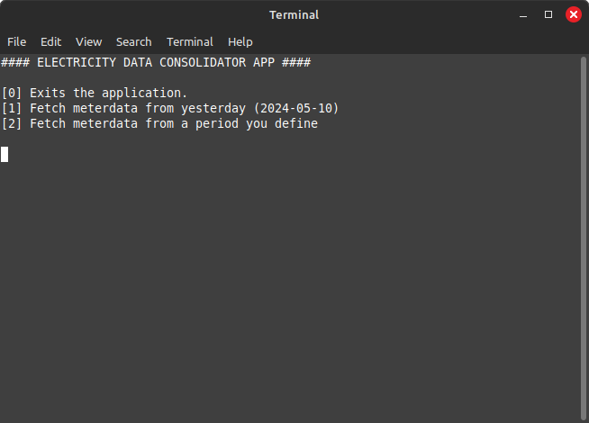

# electricity-data-consolidator
[](https://github.com/Noitcereon/electricity-data-consolidator/actions/workflows/maven.yml)

An application that communicates with external APIs to retrieve their data automatically at certain intervals (NOTE: as of now it is not automatic and will happen via a Console interface)

The idea is to get the data and make the accumulated data available in different formats (such as a .csv, .json or .xml file). This can then be used in e.g. an Excel sheet.

This project is still in its infancy and thus only has very limited functionality exposed via a console UI. At the time of writing it can:

- Automatically fetch new data access tokens (provided an eloverblik api key)
- Fetch MeterData (electricity usage and generation) from the El Overblik API as .csv file from yesterday
- Fetch MeterData from the El Overblik API as .csv file in custom period.

## Install
This section is split in three: 
1. How to install the application from a distribution .zip file (`electricity-data-consolidator-x-distribution.zip`)
2. Making a distribution file from source code
3. Making an installer for Windows with [jpackage](https://docs.oracle.com/en/java/javase/17/docs/specs/man/jpackage.html).

### Installation from zip file

1. Download the .zip file (`electricity-data-consolidator-x-distribution.zip`) with x being version of the app.
2. Get API key for ElOverblikAPI for your user account
3. Open /config folder
4. Make a file called `api-key.conf` with content similar to:
   ```conf
    api-key=your.api.key.all.in.one-line
    ```
   * Alternatively copy the `example-api-key.conf` and rename it to `api-key.conf` with your api-key in it.
5. Now you can go to [Usage](#usage) to find out how to use the app.

### Making a Distribution File

> Prerequisite: Maven v3.9.2 or later and a Java 17 JDK

The distribution file is made via the [maven-assembly-plugin](https://maven.apache.org/plugins/maven-assembly-plugin/assembly.html) and a 
custom assembly descriptor located at [/src/assembly/custom-maven-assembly-descriptor.xml](/src/assembly/custom-maven-assembly-descriptor.xml).

It should be every simple, assuming Maven can fetch dependencies from its default location.

Simply run the below maven command to make the distribution.zip file:

1. Run `mvn clean install -DisMavenSurefireTesting=true`

This should make a /target directory, containing the compiled code along with some .jar file and a .zip file.
The one we're interested in is called `electricity-data-consolidator-{version}-distribution.zip` (version comes from pom.xml).

2. Use the `electricity-data-consolidator-{version}-distribution.zip` as you want.

### Making a Windows Installer with jpackage

> **Prerequisite**: [Wix v3.x CLI tool](https://github.com/wixtoolset/wix3/releases/tag/wix3141rtm).

[jpackage](https://docs.oracle.com/en/java/javase/17/docs/specs/man/jpackage.html) is a CLI tool for creating installers.

To use the tool you must:
1. Build the application (`mvn clean package -DisMavenSurefireTesting=true`)
2. Navigate to target directory (where the executable jar with dependencies is located)
3. Run the below CLI command (this gives jpackage the arguments needed to make a Windows installer)
   ```
   jpackage @custom-jpackaging-input.jpack --verbose
   ```
4. An .exe installer file should be created, which can be distributed.

## Usage

> Prerequisites: Java 17 or later.

Simply open the application via `start.cmd` (if using Windows) or `start.sh` (on Linux/Mac) and you should
see a screen similar to below:



Then you simply select an option from the list by writing the associate number in the brackets, e.g. [1] for option 1.
and press ENTER to confirm your choice.

## Maintainer
[@Noitcereon](https://github.com/Noitcereon/)
